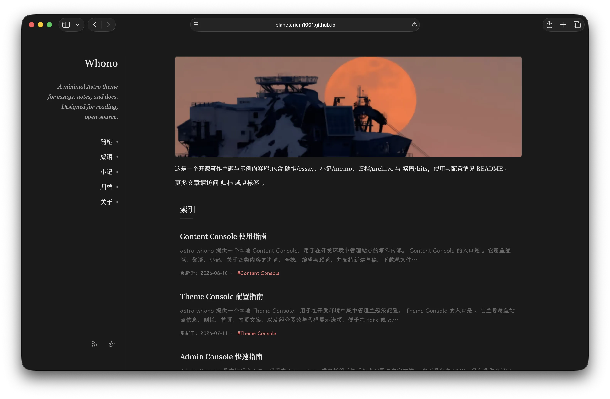
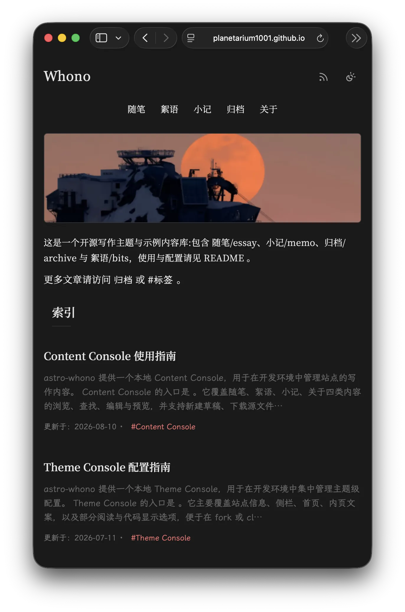
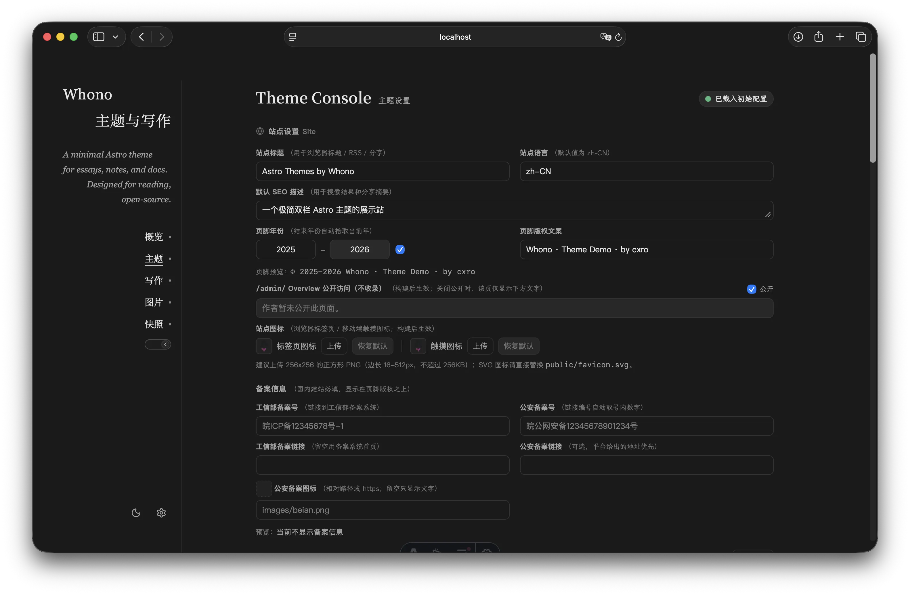
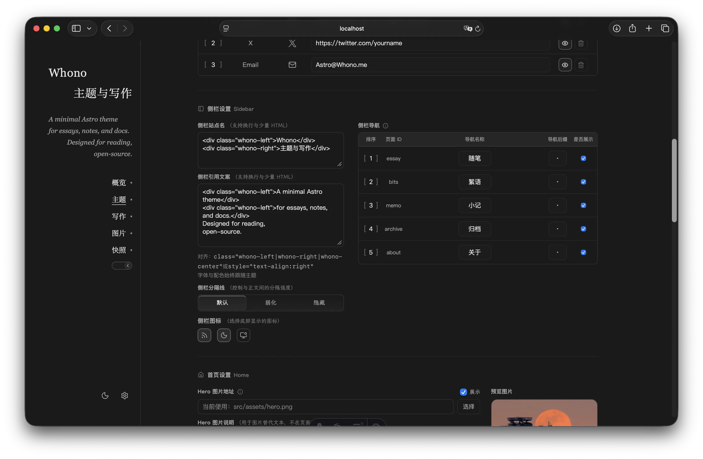
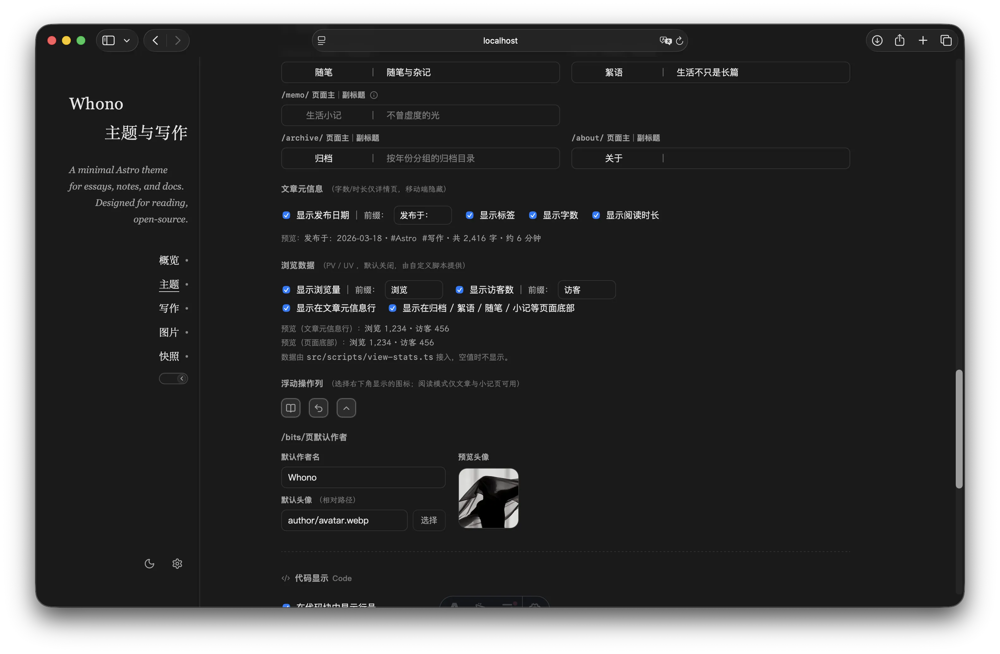

# astro-whono-tweaked

[cxro/astro-whono](https://github.com/cxro/astro-whono) 的下游分支：沿用原主题的全部功能，在此基础上补充了文章目录、阅读位置记忆等长文阅读相关的能力，并调整了部分布局尺寸

上游完整文档（部署、Admin Console、内容写作、字体子集化、Markdown 扩展等）见 [README.upstream.md](docs/README.upstream.md)

在线演示：[astro-whono-tweaked](https://planetarium1001.github.io/astro-whono-tweaked/)

## 与上游的关系

主题结构、内容集合、Admin Console、Markdown 扩展、字体子集化等都沿用上游，没有破坏性改动

本分支只做增量与局部调整

与上游的差异：

- 新增：文章目录、右下角浮动操作列、主题切换涟漪、侧栏文案富文本、浏览数据槽位、备案信息
- 重做：阅读模式的入口（移到浮动列）与进出过渡
- 调整：侧栏尺寸（320px → 224px）、壳层宽度随视口自适应

### 预览

#### 首页与文章

| 宽屏                                    | 窄屏                                    |
| --------------------------------------- | --------------------------------------- |
|     |     |
|  |  |

#### 后台管理页面

|  |  |  |
| ------------------------------------- | ------------------------------------- | ------------------------------------- |


## 本仓库的改动

### 文章目录

- 宽屏（视口 ≥ 1280px）作为壳层右侧的第 4 列常驻，正文宽度不变；阅读模式下门槛降到 1024px——左侧栏收拢后腾出的宽度正好放得下
- 窄屏折叠在正文顶部，可展开
- 把手贴在「本文目录」一行右端，收起后只留 34px 窄轨，三种状态下位置都不动
- 收起状态记在 localStorage，再次打开仍然保持，并在首次绘制前生效
- 滚动时高亮当前小节；点击跳转后目标章节短暂铺一层暖白色带便于定位，同时聚焦标题，读屏可落到该小节
- 首屏入场：先按收起态渲染，正文出来后再平滑展开目录列，避免从列表页进来时右侧突然多出一块

### 浮动操作列

文章详情 / 归档 / 絮语 / 随笔 / 小记页右下角常驻一列按钮，按需出现：

| 按钮 | 出现条件 |
| --- | --- |
| 阅读模式 | 仅文章详情与小记（沉浸页），同一按钮兼顾进入与退出 |
| 回到上次阅读位置 | 存在可回退的位置时 |
| 回到顶部 | 页面可滚动时；已在顶部则置灰 |

三个按钮都可以在 Theme Console → 内页设置 →「浮动操作列」里单独关闭；全部关闭时整列不再渲染。

「回到上次阅读位置」记录两类位置：跨次打开时按路径存 localStorage（同时记「最近标题 + 段内偏移」与滚动比例，布局变化时优先用锚点）  
本次会话内用位置栈，点目录跳转或回到顶部之前都会入栈，可原路返回

### 侧栏文案排版

侧栏站点名与引用文案支持换行与少量 HTML。

可用标签：`br`、`wbr`、`b`、`strong`、`i`、`em`、`u`、`s`、`del`、`ins`、`mark`、`small`、`sub`、`sup`、`code`、`span`、`div`、`p`、`ruby`、`rt`、`rp`
排版工具类：`whono-left`、`whono-right`、`whono-center`、`whono-block`、`whono-inline`、`whono-nowrap`

换行可用回车或 `<br>`。两行分别左右对齐：

```html
<div class="whono-left">Whono</div>
<div class="whono-right">主题与写作</div>
```

同一行内靠右：

```html
<span class="whono-block whono-right">—— 2026</span>
```

强调与居中署名混排：

```html
<b>保持阅读</b>，保持写作<br>
<div class="whono-center">—— 写于 2026</div>
```

等价的 `style` 写法同样可用，例如 `<div style="text-align:right">第二行</div>`。

两条边界：

- 白名单外的标签（如 `<a>`、`<script>`）原样显示为文本；未闭合标签自动补全，不影响后续侧栏内容。
- `style` 只保留对齐与盒模型属性（`display`、`text-align`、`white-space`、宽度、内外边距、行距、`letter-spacing`、`vertical-align`）；字体族、字号与配色始终由主题设置决定，不能在此覆盖。标签页标题、分享 meta 与读屏标签使用剥掉标签的纯文本。

### 阅读模式

- 入口从左栏移到上面的浮动列
- 桌面端：侧栏列宽收拢 + 淡出位移，正文同步放宽，右侧目录保留
- 窄屏：顶部横条按脚本量出的真实高度收起
- 进出都遵循 `prefers-reduced-motion`

### 主题切换涟漪

切换浅色 / 深色时，新主题以点击处为圆心做圆形展开（View Transitions API）  
不支持该 API 或系统偏好减少动效时直接切换

### 备案信息（ICP / 公安联网备案）

国内建站必须在页脚悬挂备案号。两项都在 Theme Console → 站点设置 →「备案信息」里填，默认不显示；渲染在页脚最底部（版权行之下、居中）。

| 字段 | 说明 |
| --- | --- |
| 工信部备案号 | 如 `皖ICP备12345678号-1`，链接固定指向 [工信部备案管理系统](https://beian.miit.gov.cn/)；广东填主体备案号，其他省份填网站备案号 |
| 公安备案号 | 如 `皖公网安备12345678901234号`，取号内数字串拼成 `https://beian.mps.gov.cn/#/query/webSearch?code=<编号>` |
| 工信部备案链接 | 可选覆盖，留空用备案系统首页 |
| 公安备案链接 | 可选覆盖，平台给出的地址优先 |
| 公安备案图标 | https 图片地址或 `public/**` 相对路径；留空只显示文字，文件缺失时不输出图标 |

> 依据《非经营性互联网信息服务备案管理办法》，备案编号须在主页底部中央标明并链接工信部备案管理系统，未链接可被处五千元以上一万元以下罚款。
>
> 公安联网备案须在网站开通之日起 30 日内通过 [全国互联网安全管理服务平台](https://beian.mps.gov.cn/#/)办理，编号（14 位：6 位属地码 + `02` + 6 位顺序码）与图标均由该平台下发，审核通过后 30 日内放到网页底部（详见 [公安联网备案常见问题](https://cloud.tencent.com/document/product/243/19616)）。

链接仅允许 `beian.miit.gov.cn`（ICP）与 `beian.mps.gov.cn` / `beian.gov.cn`（公安，兼容旧写法）

换域名时改 `ADMIN_ICP_FILING_HOSTS`、`ADMIN_POLICE_FILING_HOSTS`。

### 浏览数据（PV / UV）

主题只渲染位置、样式与 DOM 槽位，数字由站点自行接入；

默认关闭，未填值时槽位不占位、不引起重排。

开关、前缀文案与显示位置都在 Theme Console → 内页设置 →「浏览数据」。

| 位置         | 出现处                                                       |
| ------------ | ------------------------------------------------------------ |
| 文章元信息行 | 文章详情页：日期 · 标签 · 字数 · 约 N 分钟 · 浏览 N · 访客 N |
| 页面底部     | 归档 / 絮语 / 随笔列表 / 小记 / 关于 / 首页，页脚版权之上    |

槽位契约：

```html
<span class="meta-line__item view-stats" data-view-stats
      data-view-scope="article" data-view-path="/archive/hello/"
      data-view-route="/archive/hello/" data-view-title="Hello">
  <span class="view-stats__item" data-view-stat="pv" hidden>
    <span class="view-stats__label">浏览</span>
    <span class="view-stats__value" data-view-stat-value></span>
  </span>
  <span class="view-stats__item" data-view-stat="uv" hidden>…访客…</span>
</span>
```

| 属性              | 含义                                                         |
| ----------------- | ------------------------------------------------------------ |
| `data-view-scope` | 页面类型：`article` / `archive` / `bits` / `memo` / `essay` / `about` / `home` |
| `data-view-path`  | `Astro.url.pathname`，含部署 base，与统计服务记录的 URL 一致 |
| `data-view-route` | 去掉 base 的逻辑路由                                         |
| `data-view-title` | 剥掉标签的纯文本标题                                         |

#### 接入

| 要做的事   | 改哪里                                                       |
| ---------- | ------------------------------------------------------------ |
| 上报访问   | `src/layouts/BaseLayout.astro` 的 `<head>` 内加 tracker `<script>` |
| 填充数字   | `src/scripts/view-stats.ts`（唯一接入点，默认空实现）        |
| 开关与位置 | Theme Console → 内页设置 →「浏览数据」，写入 `src/data/settings/ui.json` |

`src/lib/view-stats.ts` 提供 `resolveViewStats()`、`setViewStatValue()`（写入并摘掉 `hidden`，数字千分位）与 `formatViewStatValue()`；脚本仅在开关打开时引入。

```js
import { resolveViewStats, setViewStatValue } from '../lib/view-stats';

const root = document.querySelector('[data-view-stats]');
const path = root?.dataset.viewPath ?? location.pathname;
const { pv, uv } = await fetch(`https://stats.example.com/api?path=${encodeURIComponent(path)}`)
  .then((r) => r.json());
for (const item of resolveViewStats('pv')) setViewStatValue(item, pv);
for (const item of resolveViewStats('uv')) setViewStatValue(item, uv);
```

需要 AI 辅助编写时，把 [docs/llm-view-stats-prompt.md](docs/llm-view-stats-prompt.md) 的全文复制给模型，按需补全最后一节。

#### 自建 / 本地 Umami

1. **建站**：Umami → Add website，记录 website id。

2. **上报**：在 `src/layouts/BaseLayout.astro` 的 `<head>` 内加入 tracker，`src` 指向实例地址：

   ```html
   <script defer src="https://stats.example.com/script.js" data-website-id="你的-website-id"></script>
   ```

   脚本默认上报到自身地址，不同源时用 `data-host-url` 指定；`data-domains` 可限定统计域名，其余属性见 [Tracker configuration](https://docs.umami.is/docs/tracker-configuration)。加完在 Realtime 中确认上报生效。

3. **开分享**：该 website → Edit → **Share URL** → Add，勾选需要公开的视图，得到 `https://stats.example.com/share/<slug>/<name>`，其中 `<slug>` 供下一步使用（[Enable Share URL](https://docs.umami.is/docs/enable-share-url)）。

4. **填脚本**：按 `src/scripts/view-stats.ts` 中的 Umami 片段填入实例地址与 slug。`GET /api/share/{slug}` 免认证，返回资源引用、参数与作用域受限的 token，再用它请求 `GET /api/websites/{id}/stats?...&path=<路径>`（[Open a share by its slug](https://docs.umami.is/docs/api-reference/get-share-by-slug)、[Get website summary statistics](https://docs.umami.is/docs/api-reference/get-website-stats)）。字段位置以实例为准，可对照分享页的 Network 面板。

5. **开开关**：内页设置 →「浏览数据」勾选开关与位置，`npm run dev` 验证。

本地实例上线时需注意三点：

- **混合内容与私有网络**：站点为 `https://` 时，浏览器会拒绝请求 `http://` 或内网地址（`localhost`、`192.168.x.x`）。本机开发不受影响；上线需为 Umami 配置 https 域名（反代 + 证书）或隧道服务。

- **跨域**：读接口是否返回 `Access-Control-Allow-Origin` 取决于实例配置，先确认：

  ```bash
  curl -sI -H "Origin: https://你的域名" "https://stats.example.com/api/share/<slug>" | grep -i access-control
  ```

  未放行时加一层同源代理（Cloudflare Worker / Nginx 反代 `/stats/*`），脚本改请求代理地址即可。

- **分享范围**：share 为免登录只读，持有链接即可查看勾选的全部视图（路径、来源、国家等）。仅勾选必要视图，停用后及时删除。

#### busuanzi / vercount

该类服务由脚本写入自身约定的 DOM（如 `busuanzi_value_page_pv`），与上述槽位互不通用：

- 直接使用其脚本：在页面中放置它的容器与脚本，并关闭后台「浏览数据」，否则会残留一组永不填值的空槽位。

  ```html
  <span id="busuanzi_container_page_pv">本文浏览 <span id="busuanzi_value_page_pv"></span> 次</span>
  <script defer src="//busuanzi.ibruce.info/busuanzi/2.3/busuanzi.pure.mini.js"></script>
  ```

- 自建 [vercount](https://github.com/EvanNotFound/vercount)（相同 span id，Go + Redis）：可继续使用其脚本，也可调用其接口后填入本主题槽位。

#### 取数口径

Umami 的数字来自查询，不会写入站点 HTML，无需定期改动页面。除免认证 share 通道外，官方另有两类路径：[iframe 嵌入分享页](https://docs.umami.is/docs/guides/embed-analytics-in-your-app)、[定时拉取](https://docs.umami.is/docs/guides/automate-reporting-with-api)（cron / GitHub Actions）；[API key](https://docs.umami.is/docs/api/authentication) 为全量读写凭据，不得用于前端。

两点口径（[Metric definitions](https://docs.umami.is/docs/metric-definitions)）：

- `visitors` 为唯一 session 数，session 盐每月轮换，不等于历史累计唯一访客，跨时间窗口不可相加；
- `totaltime`（平均停留时长）仅统计浏览多页的访问，单页跳出不计入，不宜作为「平均阅读时长」。

主题因此只固定 `pv` / `uv` 两个槽位；停留时长、跳出率等聚合指标可在自己的脚本中追加节点，样式沿用 `.view-stats`。

### 布局与一致性

- 侧栏 320px → 224px，前台与后台共用同一组内边距 token，两侧内容宽度一致
- 壳层宽度改为随视口自适应，大屏不再固定 1100px
- 新增 `npm run check:home-critical-css`：首页首屏 critical CSS 是手写快照且位于 global.css 之后会覆盖真实样式，该脚本检查它与 `src/styles` 是否漂移，已接入 `npm run check`
- 后台偏好设置的弹层改为向右展开并限制高度，避免超出视口
- 修复滚动条出现或消失时的整页横跳：`html` 固定滚动条槽位（老版 Safari 退化为常驻滚动条），首页首屏 critical CSS 同步，图片灯箱的滚动锁按实测宽度补偿


## 上游已有功能

- 双栏布局与移动端适配
- 内容集合（随笔 / 絮语 / 小记 / 关于，归档为目录视图）
- 本地 Admin Console（`/admin/`，含 Theme / Content / Images / Data Console）
- 絮语草稿生成器；RSS（归档 + 分栏）
- 浅色 / 深色模式
- 自托管子集字体
- Callout、Figure、Gallery、公式等 Markdown 扩展

细节见上游文档。


## 开始使用

克隆本仓库或fork到自己的仓库，拉取到本地并进入仓库文件夹

```bash
npm install
npm run dev
```

常用命令：`npm run dev`、`npm run build`、`npm run preview`、`npm run new:bit`；维护校验 `npm run verify`。


## 仓库结构

```
src/content/       内容源文件：essay / bits / memo / about
src/pages/         路由；admin/ 与 api/admin/ 仅开发环境可用
src/layouts/       BaseLayout、ArticleLayout
src/components/    展示组件；admin/ 为后台界面
src/lib/           设置解析、内容读取与后台逻辑；admin-console/ 为后台专用
src/scripts/       前台脚本；admin-*/ 为后台专用
src/styles/        样式入口与各组件样式
src/plugins/       Markdown 渲染管线：rehype 插件与 HTML 白名单
src/utils/         通用工具：格式化、日期、图片路径
src/assets/        交给 Astro 优化的图片
src/data/settings/ 主题设置 JSON：site / shell / home / page / ui
src/test-fixtures/ Markdown 冒烟测试夹具
public/            静态资源与上传目录：images/、fonts/、author/ 等
scripts/           仓库维护脚本：字体子集、校验、new:bit
tools/             字体字符集快照
tests/             Vitest 用例
docs/              仓库文档
```

后台只在 `npm run dev` 下可用：`/admin/`（内容与图片）、`/admin/theme/`（主题设置）。

## 写作指引

| 类型 | 源文件 | 入口 |
| --- | --- | --- |
| 随笔 | `src/content/essay/` | `/essay/`、`/archive/`、`/archive/<slug>/` |
| 絮语 | `src/content/bits/` | `/bits/` |
| 小记 | `src/content/memo/index.md` | `/memo/` |
| 关于 | `src/content/about/index.md` | `/about/` |

三种写作入口：`npm run dev` 后用 `/admin/content/`（新建、编辑、图片上传与预览）；直接在对应目录新增 `.md`（文件名即 slug，可用 frontmatter 的 `slug` 覆盖）；`npm run new:bit` 生成絮语草稿。

随笔 frontmatter：

| 字段 | 必填 | 说明 |
| --- | --- | --- |
| `title` | 是 | 标题 |
| `date` | 是 | `YYYY-MM-DD` 或带时区的 ISO 8601 |
| `description` | 否 | 摘要，留空时按正文截取 |
| `tags` | 否 | 字符串数组，默认空 |
| `draft` | 否 | `true` 仅本地预览，构建、公开列表与 RSS 会过滤 |
| `archive` | 否 | 默认 `true`；`false` 只退出归档聚合，详情页与随笔列表仍可见 |
| `publishedAt`、`updatedAt` | 否 | `publishedAt` 为带时区的 ISO 8601；`updatedAt` 接受 `YYYY-MM-DD` 或带时区的 ISO 8601，且不得早于 `date` |
| `slug` | 否 | 小写 kebab-case，覆盖默认路径 |
| `cover`、`badge` | 否 | 封面与角标 |

絮语用 `title?`、`date`、`tags`、`draft`、`images[]`（`src` 为 `public/**` 相对路径或 https 地址）、`author?`；小记用 `title?`、`subtitle?`、`date?`、`draft`。

图片放在 `public/` 下（如 `public/images/post/a.webp`），正文写 `/images/post/a.webp`；絮语的 `images[].src` 与 `author.avatar` 不带前导斜杠、也不带 `public/`（如 `author/avatar.webp`）。小记与关于是固定单页：正文写在各自的 `index.md`，标题与副标题可在 Theme Console → 内页设置里覆盖，留空时沿用文件内的值。

提交前跑 `npm run check`（类型与守卫）与 `npm test`，或一次跑完 `npm run verify`。字段与 Markdown 扩展的细节见 [README.upstream.md](docs/README.upstream.md) 的「内容与写作」，站内见 `/archive/content-console-guide/` 与 `/archive/markdown-guide/`。

## 调参

| 需要调整的内容 | 变量 / 常量 | 位置 |
| --- | --- | --- |
| 左侧栏宽度 | `--sidebar`、`--public-sidebar-inline-size` | `src/styles/global.css` |
| 侧栏内边距（前后台共用） | `--sidebar-padding-block`、`--sidebar-padding-inline` | `src/styles/global.css` |
| 壳层最大宽度 | `--layout-shell-max-inline-size` | `src/styles/global.css` |
| 正文宽度上限 | `--max` | `src/styles/global.css` |
| 主题切换涟漪时长与曲线 | `RIPPLE_DURATION_MS`、`RIPPLE_EASING` | `src/scripts/sidebar-theme.ts` |
| 阅读模式过渡时长 | 脚本 `READING_ANIM_MS`，需与样式里的 `520ms` 一致 | `src/scripts/sidebar-reading.ts`、`src/styles/components/layout.css` |
| 目录列宽 / 收起后的窄轨 | `--article-toc-inline-size`、`--article-toc-handle-column` | `src/styles/components/article-toc.css` |
| 目录出现的宽度门槛 | `@media (min-width: 1280px)`（普通）、`1024px`（阅读） | 同上 |
| 目录首屏展开前的等待 | 脚本内的 `600`（毫秒） | `src/scripts/article-toc.ts` |
| 跳转高亮底色与时长 | `--prose-flash-bg`、`FLASH_DURATION_MS` | `src/styles/components/article-toc.css`、`src/scripts/article-toc.ts` |
| 浮动按钮尺寸 | `--float-button-size` | `src/styles/components/layout.css` |
| 侧栏文案可用的排版工具类 | `.whono-left` / `.whono-right` / `.whono-center` / `.whono-block` / `.whono-inline` / `.whono-nowrap` | `src/styles/components/layout.css` |
| 设置富文本白名单（可用标签、可保留的 style 属性） | `ALLOWED_TAGS`、`ALLOWED_STYLE_PROPERTIES` | `src/lib/setting-html.ts` |
| 浏览数据槽位样式 / 填值 helper | `.view-stats*`、`resolveViewStats`、`setViewStatValue` | `src/styles/components/view-stats.css`、`src/lib/view-stats.ts` |
| 浏览数据接入点 | — | `src/scripts/view-stats.ts` |
| 备案链接白名单 | `ADMIN_ICP_FILING_HOSTS`、`ADMIN_POLICE_FILING_HOSTS` | `src/lib/admin-console/theme-shared.ts` |
| 备案号长度上限 | `ADMIN_FILINGS_NUMBER_MAX_LENGTH` | `src/lib/admin-console/theme-shared.ts` |
| 页脚备案图标尺寸 | `--site-footer-filing-icon-size` | `src/styles/components/layout.css` |

改动侧栏或壳层尺寸后，需要同步 `src/pages/index.astro` 里 `homeHeadCriticalCss` 的对应声明（该快照会覆盖 global.css），`npm run check:home-critical-css` 会指出不一致的项。

## CI 与预览部署

仓库自带两个 GitHub Actions 工作流，都不需要配置 secret：

| 工作流 | 触发 | 作用 | 权限 |
| --- | --- | --- | --- |
| `ci.yml` | push / PR 到 `main` | `npm ci` + `npm run ci`（astro check、守卫、vitest、build） | `contents: read` |
| `pages.yml` | push 到 `main`、手动触发 | 构建并发布到 GitHub Pages | `contents: read`、`pages: write`、`id-token: write` |

启用 Pages 预览：

1. 仓库设为 public——Free 计划下私有仓库无法使用 Pages。
2. Settings → Pages → Source 选 **GitHub Actions**，不需要 `gh-pages` 分支。建议先设好再 push，否则首次运行会在 deploy 步骤因「Pages 尚未启用」失败；遇到失败可以在 Actions 里对该次运行点 Re-run all jobs 重试。
3. push 到 `main`，或在 Actions → pages 里手动 Run workflow。

站点地址：

- 项目页在仓库子路径下：`https://<owner>.github.io/<repo>/`。
- 仓库名恰好是 `<owner>.github.io`（用户主页仓库）时发布在根 `https://<owner>.github.io/`；工作流会识别这种情况并把 base 设为 `/`，canonical 与资源路径都不带仓库名，不会出现 `<owner>.github.io/<owner>.github.io` 这类重复路径。
- 站点域名与 base 都在构建时按仓库名推导，改仓库名后无需改工作流，旧地址由 GitHub 自动跳转。

其他：

- fork 后 `pages.yml` 默认跳过（`if: github.repository == '…'` 守卫），不会因为未启用 Pages 而失败；想在自己的 fork 里发布预览，把那行改成自己的仓库名并启用 Pages，base 会按你的仓库名推导。
- 绑定自定义域名后站点会移到域名根路径，需要把工作流里的 `SITE_URL` 与 `ASTRO_WHONO_BASE_PATH` 改成固定值（`https://你的域名` 与 `/`），否则资源路径会带上仓库子路径而 404。
- 不需要 Pages 预览时，删掉 `.github/workflows/pages.yml` 即可，`ci.yml` 与构建不受影响。


## 上游文档

原主题的完整说明——环境要求、部署、配置入口、内容与写作、字体与许可、RSS、贡献方式：**[README.upstream.md](docs/README.upstream.md)**（English Version: [README.en.md](docs/README.upstream.en.md)）。

同步上游：

```bash
git remote add upstream https://github.com/cxro/astro-whono.git
git fetch upstream --tags
git checkout main
git merge upstream/main
npm run check
```

`npm run check` 里包含首屏 critical CSS 的漂移检查，合并上游后如果它报错，说明上游改动了侧栏或壳层尺寸，需要同步 `src/pages/index.astro` 的 `homeHeadCriticalCss`。


## 许可

MIT，见 [LICENSE](LICENSE)。

