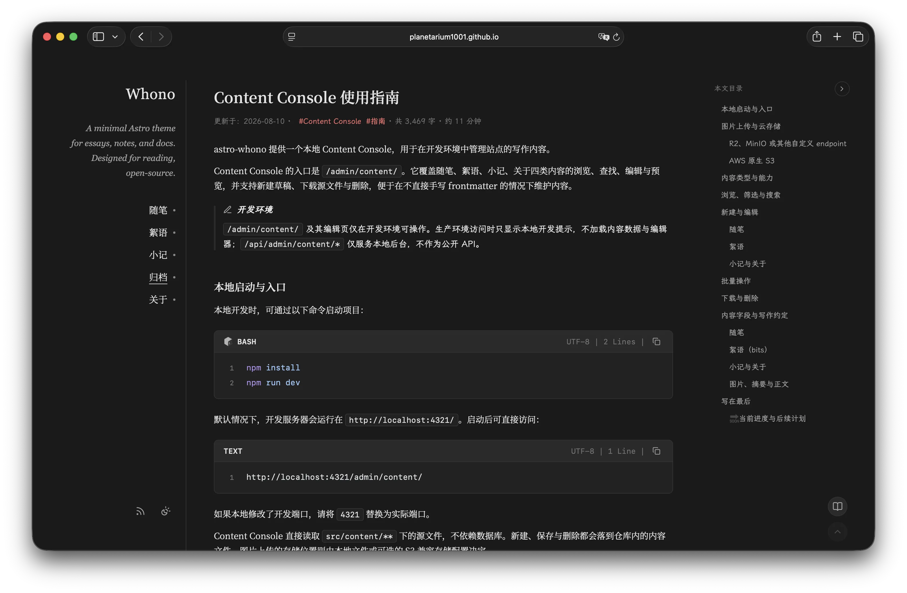
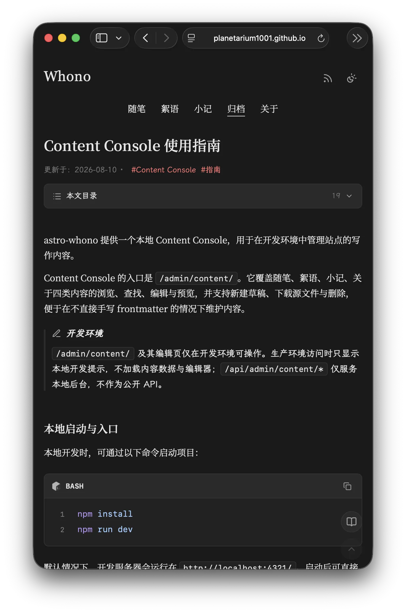

# astro-whono-tweaked

[cxro/astro-whono](https://github.com/cxro/astro-whono) 的下游分支：沿用原主题的全部功能，在此基础上补充了文章目录、阅读位置记忆等长文阅读相关的能力，并调整了部分布局尺寸

上游完整文档（部署、Admin Console、内容写作、字体子集化、Markdown 扩展等）见 [README.upstream.md](README.upstream.md)

在线演示：[astro-whono-tweaked](https://planetarium1001.github.io/astro-whono-tweaked/)

## 与上游的关系

主题结构、内容集合、Admin Console、Markdown 扩展、字体子集化等都沿用上游，没有破坏性改动

本分支只做增量与局部调整

与上游的差异：

- 新增：文章目录、右下角浮动操作列、主题切换涟漪
- 重做：阅读模式的入口（移到浮动列）与进出过渡
- 调整：侧栏尺寸（320px → 224px）、壳层宽度随视口自适应
- 修复：前后台侧栏内容宽度不一致、后台偏好设置弹层超出视口

## 本仓库的改动

### 预览

| 宽屏                                     | 窄屏                                     |
| ---------------------------------------- | ---------------------------------------- |
|     |     |
|  |  |

### 文章目录

- 宽屏（视口 ≥ 1280px）作为壳层右侧的第 4 列常驻，正文宽度不变；阅读模式下门槛降到 1024px——左侧栏收拢后腾出的宽度正好放得下
- 窄屏折叠在正文顶部，可展开
- 把手贴在「本文目录」一行右端，收起后只留 34px 窄轨，三种状态下位置都不动
- 收起状态记在 localStorage，再次打开仍然保持，并在首次绘制前生效
- 滚动时高亮当前小节；点击跳转后目标章节短暂铺一层暖白色带便于定位，同时聚焦标题，读屏可落到该小节
- 首屏入场：先按收起态渲染，正文出来后再平滑展开目录列，避免从列表页进来时右侧突然多出一块

### 浮动操作列

文章详情 / 归档 / 絮语 / 随笔 / 小记页右下角常驻一列按钮，按需出现：

| 按钮 | 出现条件 |
| --- | --- |
| 阅读模式 | 仅文章详情与小记（沉浸页），同一按钮兼顾进入与退出 |
| 回到上次阅读位置 | 存在可回退的位置时 |
| 回到顶部 | 页面可滚动时；已在顶部则置灰 |

「回到上次阅读位置」记录两类位置：跨次打开时按路径存 localStorage（同时记「最近标题 + 段内偏移」与滚动比例，布局变化时优先用锚点）  
本次会话内用位置栈，点目录跳转或回到顶部之前都会入栈，可原路返回

### 阅读模式

- 入口从左栏移到上面的浮动列
- 桌面端：侧栏列宽收拢 + 淡出位移，正文同步放宽，右侧目录保留。
- 窄屏：顶部横条按脚本量出的真实高度收起
- 进出都遵循 `prefers-reduced-motion`

### 主题切换涟漪

切换浅色 / 深色时，新主题以点击处为圆心做圆形展开（View Transitions API）  
不支持该 API 或系统偏好减少动效时直接切换

### 布局与一致性

- 侧栏 320px → 224px，前台与后台共用同一组内边距 token，两侧内容宽度一致
- 壳层宽度改为随视口自适应，大屏不再固定 1100px
- 新增 `npm run check:home-critical-css`：首页首屏 critical CSS 是手写快照且位于 global.css 之后会覆盖真实样式，该脚本检查它与 `src/styles` 是否漂移，已接入 `npm run check`
- 后台偏好设置的弹层改为向右展开并限制高度，避免超出视口


## 上游已有功能

- 双栏布局与移动端适配
- 内容集合（随笔 / 絮语 / 小记 / 关于，归档为目录视图）
- 本地 Admin Console（`/admin/`，含 Theme / Content / Images / Data Console）
- 絮语草稿生成器；RSS（归档 + 分栏）
- 浅色 / 深色模式
- 自托管子集字体
- Callout、Figure、Gallery、公式等 Markdown 扩展

细节见上游文档。


## 开始使用

克隆本仓库或fork到自己的仓库，拉取到本地并进入仓库文件夹

```bash
npm install
npm run dev
```

常用命令：`npm run dev`、`npm run build`、`npm run preview`、`npm run new:bit`；维护校验 `npm run verify`。


## 调参

| 需要调整的内容 | 变量 / 常量 | 位置 |
| --- | --- | --- |
| 左侧栏宽度 | `--sidebar`、`--public-sidebar-inline-size` | `src/styles/global.css` |
| 侧栏内边距（前后台共用） | `--sidebar-padding-block`、`--sidebar-padding-inline` | `src/styles/global.css` |
| 壳层最大宽度 | `--layout-shell-max-inline-size` | `src/styles/global.css` |
| 正文宽度上限 | `--max` | `src/styles/global.css` |
| 主题切换涟漪时长与曲线 | `RIPPLE_DURATION_MS`、`RIPPLE_EASING` | `src/scripts/sidebar-theme.ts` |
| 阅读模式过渡时长 | 脚本 `READING_ANIM_MS`，需与样式里的 `520ms` 一致 | `src/scripts/sidebar-reading.ts`、`src/styles/components/layout.css` |
| 目录列宽 / 收起后的窄轨 | `--article-toc-inline-size`、`--article-toc-handle-column` | `src/styles/components/article-toc.css` |
| 目录出现的宽度门槛 | `@media (min-width: 1280px)`（普通）、`1024px`（阅读） | 同上 |
| 目录首屏展开前的等待 | 脚本内的 `600`（毫秒） | `src/scripts/article-toc.ts` |
| 跳转高亮底色与时长 | `--prose-flash-bg`、`FLASH_DURATION_MS` | `src/styles/components/article-toc.css`、`src/scripts/article-toc.ts` |
| 浮动按钮尺寸 | `--float-button-size` | `src/styles/components/layout.css` |

改动侧栏或壳层尺寸后，需要同步 `src/pages/index.astro` 里 `homeHeadCriticalCss` 的对应声明（该快照会覆盖 global.css），`npm run check:home-critical-css` 会指出不一致的项。

## CI 与预览部署

仓库自带两个 GitHub Actions 工作流，都不需要配置 secret：

| 工作流 | 触发 | 作用 | 权限 |
| --- | --- | --- | --- |
| `ci.yml` | push / PR 到 `main` | `npm ci` + `npm run ci`（astro check、守卫、vitest、build） | `contents: read` |
| `pages.yml` | push 到 `main`、手动触发 | 构建并发布到 GitHub Pages | `contents: read`、`pages: write`、`id-token: write` |

启用 Pages 预览：

1. 仓库设为 public——Free 计划下私有仓库无法使用 Pages。
2. Settings → Pages → Source 选 **GitHub Actions**，不需要 `gh-pages` 分支。建议先设好再 push，否则首次运行会在 deploy 步骤因「Pages 尚未启用」失败；遇到失败可以在 Actions 里对该次运行点 Re-run all jobs 重试。
3. push 到 `main`，或在 Actions → pages 里手动 Run workflow。

站点地址：

- 项目页在仓库子路径下：`https://<owner>.github.io/<repo>/`。
- 仓库名恰好是 `<owner>.github.io`（用户主页仓库）时发布在根 `https://<owner>.github.io/`；工作流会识别这种情况并把 base 设为 `/`，canonical 与资源路径都不带仓库名，不会出现 `<owner>.github.io/<owner>.github.io` 这类重复路径。
- 站点域名与 base 都在构建时按仓库名推导，改仓库名后无需改工作流，旧地址由 GitHub 自动跳转。

其他：

- fork 后 `pages.yml` 默认跳过（`if: github.repository == '…'` 守卫），不会因为未启用 Pages 而失败；想在自己的 fork 里发布预览，把那行改成自己的仓库名并启用 Pages，base 会按你的仓库名推导。
- 绑定自定义域名后站点会移到域名根路径，需要把工作流里的 `SITE_URL` 与 `ASTRO_WHONO_BASE_PATH` 改成固定值（`https://你的域名` 与 `/`），否则资源路径会带上仓库子路径而 404。
- 不需要 Pages 预览时，删掉 `.github/workflows/pages.yml` 即可，`ci.yml` 与构建不受影响。


## 上游文档

原主题的完整说明——环境要求、部署、配置入口、内容与写作、字体与许可、RSS、贡献方式：**[README.upstream.md](README.upstream.md)**（英文版 [README.en.md](README.en.md)）。

同步上游：

```bash
git remote add upstream https://github.com/cxro/astro-whono.git
git fetch upstream --tags
git checkout main
git merge upstream/main
npm run check
```

`npm run check` 里包含首屏 critical CSS 的漂移检查，合并上游后如果它报错，说明上游改动了侧栏或壳层尺寸，需要同步 `src/pages/index.astro` 的 `homeHeadCriticalCss`。


## 许可

MIT，见 [LICENSE](LICENSE)。

